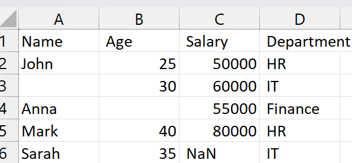
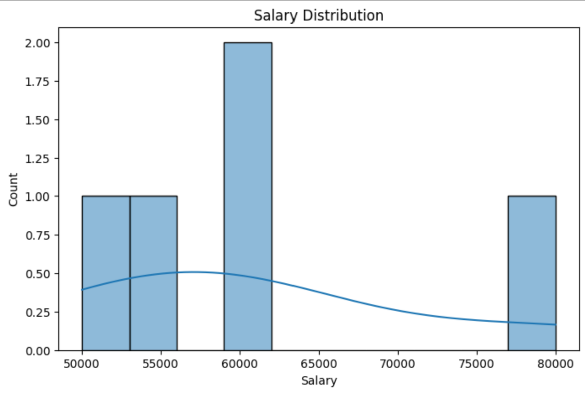
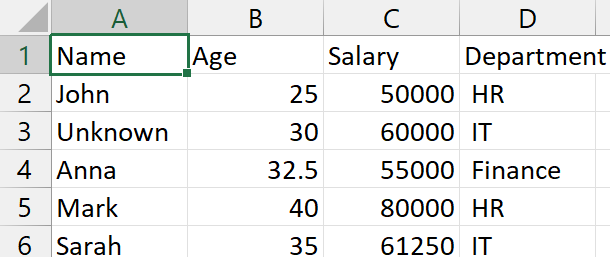

# Data Cleaning & Analysis Assistant

This project automates the cleaning and analysis of messy CSV/Excel data. It identifies missing values, detects outliers, normalizes data, and generates insightful reports with visualizations.

## Features

- **Handles missing values (fills with mean/median or "Unknown" for categorical data)**
- **Detects outliers using the Interquartile Range (IQR) method**
- **Normalizes numerical data using Min-Max Scaling**
- **Generates statistical reports and visualizations (Matplotlib & Seaborn)**
- **Saves the cleaned dataset for further analysis**

## Tech Stack

- **Python** 
- **Pandas** (for data manipulation)
- **Matplotlib & Seaborn** (for data visualization)
- **Jupyter Notebook** (for interactive execution)

## Installation

1. **Clone the Repository**:
   ```sh
   git clone https://github.com/kbhavneet/data-cleaning-project.git
   cd data-cleaning
   ```
2. **Install Dependencies**:
   ```sh
   pip install pandas matplotlib seaborn openpyxl numpy scikit-learn
   ```
3. **Run Jupyter Notebook**:
   ```sh
   jupyter notebook
   ```
   - Open `data_cleaning_final.ipynb` and execute the cells.

## Usage

1. **Place Your Dataset** (`.csv` or `.xlsx`) inside the project folder as `sample_data.csv`.
2. **Run the Jupyter Notebook** to clean and process the data.
3. **View the Insights**:
   - Processed data is saved as `cleaned_data.csv`.
   - Visualization plots display trends and distributions.

## Example Output

### **Raw Data (Before Cleaning)**



### Salary Distribution Visualization



### **Cleaned Data (After Processing)**



❤️

